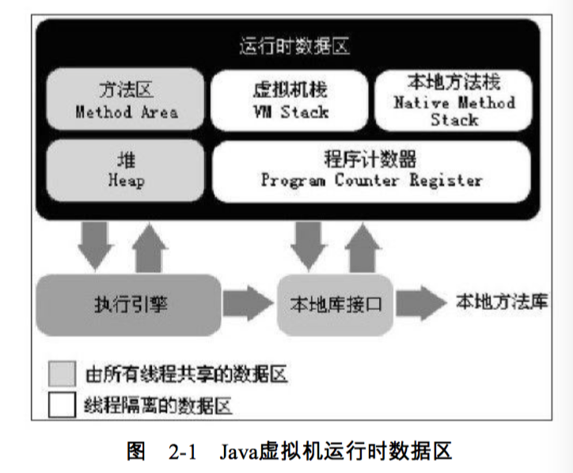

####运行时数据区域
JVM在执行程序时会把管理的内存划分为若干个不同的数据区域。

运行时数据区包括以下：

1. 方法区（Method Area）——所有线程共享数据
2. 堆（Heap）——所有线程共享数据 
3. 程序计数器（Program Counter Register）——线程私有
4. 虚拟机栈（VM Stack）——线程私有
5. 本地方法栈（Native Method Stack）——线程私有

以上的运行时数据区，对外连接执行引擎、本地库接口、本地方法库

#####程序计数器
Program Counter Register，一块较小的内存空间，可以看作是当前线程所执行代码的字节码的行号指示器。在JVM模型中，字节码解释器通过改变这个计数器的值来选取下一条需要执行的字节码，分支、循环、跳转、try-catch、线程恢复等基础功能都需要这个计数器来完成。
Java虚拟机的多线程是通过线程轮流切换并分配处理器执行时间来实现的。为了线程切换后能恢复到正确的位置，每条线程都需要一个独立的程序计数器。线程之间互不影响、独立存储（这类内存区域就叫线程私有内存）
线程执行一个Java方法时，计数器记录的是正在执行的虚拟机字节码指令的地址；如果执行的是Native方法，计数器为undefined。此内存区域是为唯一一个在JVM规范中没有规定任何OutOfMemoryError情况的区域。

#####Java虚拟机栈（JVM Stack）
私有的，生命周期与线程相同。JVM Stack描述的是Java方法执行的内存模型：每个方法执行的同时都会创建一个栈帧（Stack Frame）用于存储局部变量表、操作数栈、动态链接、方法出口等信息。每个方法从调用直至执行完成的过程，就对应着一个栈帧在虚拟机栈中入栈到出栈的过程。
局部变量表大小在编译期就被确定，包括编译期可知的各种基本数据类型（boolean--double）、对象引用（引向对象起始地址的引用指针，或者指向一个代表对象的句柄活其他与此对象相关的位置）和返回地址（retureAddress，指向了一条字节码指令的地址），其中long和double占用两个slot(局部变量空间，应该是4byte)，其他占用一个（注意，reference也是一个int的长度）。当执行方法的时候，需要在Stack Frame分配多大的局部变量空间是完全确定的，运行期间不会改变局部变量表的大小。
JVM Stack有两种异常，当线程请求的栈深度大于虚拟机所允许的深度，跑出StackOverflowError，如果可以动态扩展但无法申请足够的内存，就会抛出OutOfMemoryError。

#####本地方法栈
与Java虚拟机栈类似，不过JVM Stack是为执行字节码服务器，Native Method Stack则为虚拟机使用Native方法服务。虚拟机规范中对本地方法栈的语言、使用方式和数据结构没有强规定。Native Method Stack也会抛出StackOverflowError和OutOfMMemoryError。

#####Java Heap
Java堆是最大的一块，并且是所有线程共享的，在虚拟机启动时创建。存放所有的对象实例。在Java虚拟机规范中描述是：所有的对象实例以及数组都要在堆上分配。但由于[JIT编译器](http://blog.csdn.net/yangchuxi/article/details/6782358)和[逃逸分析技术](http://blog.sina.com.cn/s/blog_4b6047bc01000avq.html)，也不是所有的实例都在堆上。
Java堆是垃圾收集器管理的主要区域，所以有时候也叫GC堆（Garbage Collected Heap）,现在GC一般采用分代收集算法，所以Heap都细分为新生代和老年代。线程共享的Java堆可能划分出多个线程私有的分配缓冲区。
JVM规范中,Java Heap可以处于物理上不连续，但逻辑上连续的内存空间。当前主流VM都是按照可扩展来实现的（通过-Xmx和-Xms控制）。如果在堆中没有内存完成实例分配，并且堆无法扩展时，抛出OutOfMemoryError。

#####方法区
Method Area与Java堆一样，是各个线程共享的内存区域。用来存放被虚拟机加载的类信息、常量、静态变量、即时编译器编译后的代码等数据。JVM规范把方法区描述为堆的一个逻辑部分，但有一个别名叫Non-Heap，目的应该为了与Java Heap区分开。
HotSpot虚拟机把GC分代收集扩展到方法区，所以把方法区叫做永久代。
垃圾收集行为在这个区域是比较少见，但并非数据进了方法区就真的永久存在。这个区域内存回收主要是针对常量池的回收和类型的卸载，但回收效果一般，特别是类型卸载条件相当苛刻。
JVM规范规定当方法区无法满足内存分配需求时，抛出OutOfMemoryError。

######运行时常量池
Runtime Constant Pool，是方法区的一部分，
Class文件中除了有类的版本、字段、方法和接口等描述信息外，还有一项是常量池。用于存放编译期产生的各种字面量和符号引用，这部分内容将在类加载后进入方法区运行时常量池中存放。比如String s = "java";在编译时会优化，多个相同的常量会引用同一个。[关于常量池](http://www.cnblogs.com/dapeng111/p/3530542.html)，

运行时常量池相对于Class文件常量池，一个重要特性就是具备动态性。Java语言并不要求常量一定是编译期才能产生，也就是并非预置入class文件中常量池的内容才能进入方法区运行时常量池。运行期间产生的新的常量也能放入池中，比如**String类的intern（）方法**。

#####直接内存
直接内存（Direct Memory）并**不是JVM运行时数据区的一部分**，也不是JVM规范中定义的内存区域。但这部分内存被频繁使用，而且也可能导致OutOfMemoryError。
JDK1.4中加入了NIO（New Input/Output）类，引入了基于通道（Channel）和缓冲区（Buffer）的I/O方式，可以使用Native函数库直接分配堆外的内存，然后通过一个存储在Java堆中的DirectByteBuffer对象作为这块内存的引用进行操作。能避免Java堆和**Native堆**来回复制数据。
直接内存的分配不受Java堆大小的限制，但受到本机总内存（RAM和SWAP或者分页文件）大小和处理器寻址空间的限制，当各内存区域总和大于物理内存限制，会导致动态扩展时出现OutOfMemoryError。

[一篇不错的笔记](http://blog.csdn.net/taohuaxinmu123/article/details/24472073)

[一篇不错的笔记](http://www.cnblogs.com/dolphin0520/p/3613043.html)

#####后记
native heap，不属于JVM运行时数据区，或者说可以理解为JVM之外的OS Memory的区域，或者说JNI方法分配的内存？？。
[stackoverflow上的讨论](http://stackoverflow.com/questions/30622818/off-heap-native-heap-direct-memory-and-native-memory)

